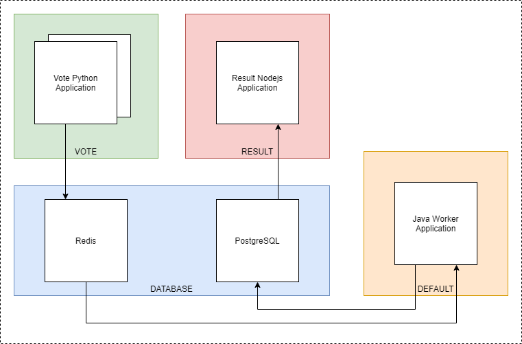

# Kuberntes

Dodatkowy branch z ostatnich zajęć, na którym znajdziecie wszystkie pliki, które należy uruchomić. W każdym z osobnych katalogów, znajdziecie aplikacje które możecie uruchomić komendą: `kubectl apply -f katalog/`.

Jako pierwszy krok, należy stworzyć 3 namespace. Można to zrobić wykonując komendy podane poniżej.

```
kubectl create ns vote
kubectl create ns result
kubectl create ns database
```

Następnie za pomocą komendy `kubectl apply -f nazwa_katalogu/` uruchamiamy aplikacje.

## Architektura


